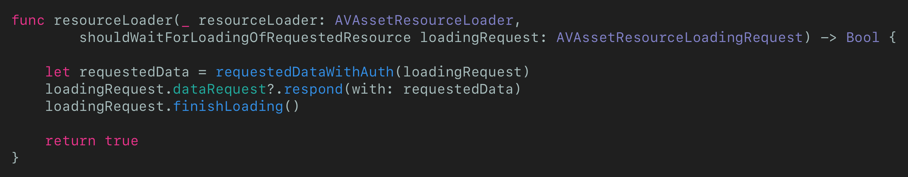

# 用 AirPlay 2 播放 AES 加密影片的坑

---

## Self Introduction

@LINE TV as a frontend manager now

Twitter: @marslin_dev

Medium: https://medium.com/@marslin_dev

---

## HLS Introduction

HLS: HTTP Live Streaming

---

---

## AirPlay Introduction

---

## Playback with Encrypted AV Media

---

## 無法投影(AirPlay)啊！

`shouldWaitForLoadingOfRequestedResource` 在 AirPlay 的時候根本沒被呼叫到！？

---

## 有沒有解啊？

ref: [AVAssetResourceLoader - resourceLoader(_:shouldWaitForLoadingOfRequestedResource:)](https://developer.apple.com/documentation/avfoundation/avassetresourceloaderdelegate/1388121-resourceloader)

> For example, the resource loader might call this method to load decryption keys that have been specified using a custom URL scheme.

註：這不是唯一解

---

## 那就來客製化 Scheme 吧！

---

---

---

## 處理客製化 Scheme

### 分開處理不同的 Resources

---

### 處理 PlayList 需求 (需修改 response)

---

### 處理其他資源需求 (不需修改 response)

---

## 總結

如果沒有特殊驗證憑證的需求，個人比較 **偏好使用 Cookie** 的方式傳遞授權驗證，但如果有像我一樣有開發上的限制或困難的話，可以考慮看看這樣的解密流程囉！

---

## Reference

用 AirPlay 2 播放 AES 加密影片的坑：https://medium.com/@marslin_dev/how-to-play-aes-encrypted-video-with-airplay-2-82a353044f40